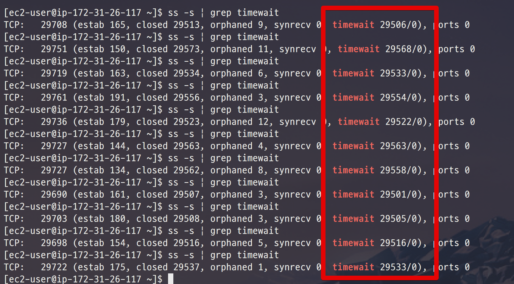
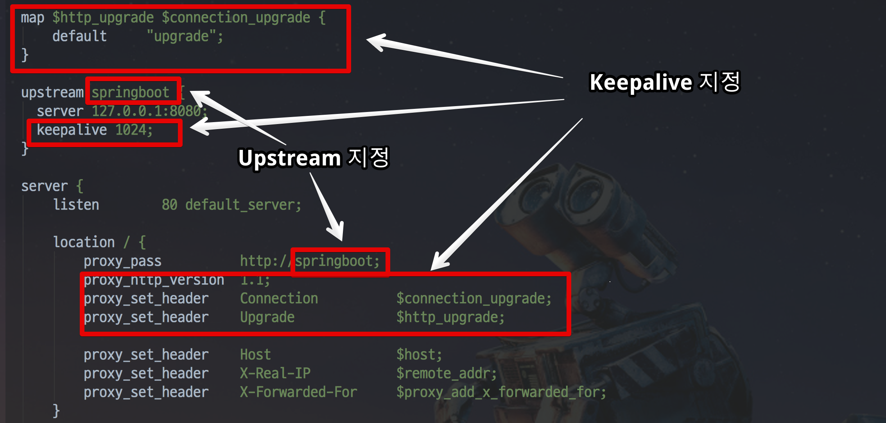

# 3. Nginx 튜닝

[지난 시간](http://jojoldu.tistory.com/319)에 보셨던것처럼 **AWS Elastic Beanstalk은 기본적으로 Nginx을 갖고 있습니다**.  
이 내용을 모르시는 분들 입장에선 성능 튜닝시 Nginx 부분은 놓치실 수 있는데요.  
그래서 이번 시간에는 Nginx와 Spring Boot 간의 성능 튜닝 과정을 진행해보겠습니다.

## 3-1. 여전히 많은 time_wait 소켓

지난 시간에 ```net.ipv4.tcp_tw_reuse``` 값을 수정하여 로컬 포트 고갈 문제를 해결하였습니다!  
그리고 수정된 버전으로 다시 한번 성능 테스트를 진행했는데요.  
  


Vuser 50으로 맞추고 테스트를 하니 TPS가 4700까지 올라갔습니다!  
중간에 DB Connection이 부족한것이 발견되어 DB Connection Pool Size와 Tomcat Thread를 조정 후 다시 성능테스트를 진행하겠습니다.  
이번엔 Vuser 100으로 맞추었습니다.


TPS가 6300까지 증가했습니다!  
  
한번더 성능 테스트를 하던 중 TIME_WAIT 소켓을 체크해보겠습니다. 



대략 3만개의 TIME_WAIT 소켓이 생성되어 유지중 이였습니다.  
**여전히 너무 많은 TIME_WAIT 소켓이 생성**되고 있습니다.  

지난 시간에 TIME_WAIT 소켓을 재사용함으로써 로컬 포트 고갈 문제는 해결되었지만, 근본적인 문제가 남아있었습니다.  
**애초에 TIME_WAIT 소켓이 쌓이지 않도록** 문제를 해결해보겠습니다.

### 3-1-1. TIME_WAIT

### 3-1-2. upstream keepalive 소개

## 3-2. Nginx와 Spring Boot간의 keepalive 설정


## 3-3. AWS Beanstalk의 Nginx 설정하기 


AWS Beanstalk에서 Nginx의 nginx.conf 파일을 수정하는 방법은 간단합니다.  


> Beanstalk 배포시에 .ebextensions 디렉토리와 jar 를 포함시키는게 어려우신 분들은 [이전에 작성된 포스팅](http://jojoldu.tistory.com/317)을 참고해보세요!




## 3-4. epoll


```
모든 것이 리눅스의 파일이기 때문에 네트워크 연결조차 파일 내부적입니다.  
모든 프로세스마다 유니크한 File Descriptor가 있습니다.  
이 File Descriptor는 어느 것이 읽거나 쓸 준비가되었는지를 식별하기 위해 자주 폴링해야합니다 (nginx 서버가 수신하는 짝수 연결은 nginx 프로세스가 파일 형식으로 유지 관리합니다 연결의 수명에 대한 설명자).

 

앞서 논의한 것처럼 nginx는 싱글 스레드로 Non Blocking I/O를 사용합니다.  
따라서 단일 프로세스는 어떤 연결 파일을 읽거나 쓸 준비가되었는지 식별해야합니다. 이를 위해 운영 체제에는 세 가지 방법이 있습니다. 아래에 언급되어 있습니다.

select
poll
epoll 
 
select와 poll을 모두 사용하면 어떤 파일 설명자가 준비되었는지를 식별하는 효율적인 방법이 아닙니다.  
따라서 nginx는 select 또는 poll 메소드를 사용하여 어떤 파일 (파일 디스크립터)이 읽히거나 쓰여질 준비가되었는지 확인할 수있다. 그러나이 두 가지 방법 모두 너무 많은 연결 수가있을 때 충분히 효율적이지 않습니다. 예를 들어 한 번에 10000 개의 연결을 제공한다고 가정합니다. 그리고 그들 중 하나만 읽을 준비가되었습니다. 하나의 파일 디스크립터가 읽을 준비가되었음을 확인하기 위해 프로세스는 나머지 9999 파일 디스크립터 (자원 낭비)를 계속 스캔해야한다.

 

select와 Poll 이외의 또 다른 방법은 epoll 이 여기에서 구하려고 온다. 이것은 2.6 이후의 Linux 커널에서만 사용 가능합니다. Epoll은 투표 및 선택에 비해 효율적인 메커니즘을 사용합니다.

 

서버에 10000 개의 연결이 있고 그 중 8000 개가 유휴 연결 인 경우 poll과 select를 사용하는 것은 효과적이지 않습니다. 왜냐하면 epoll은 활성화 된 연결에만 중요성을 부여하기 때문입니다. 모든 세 가지 선택, 설문 조사 및 epoll은 기본적으로 같은 일을하지만 epoll을 사용하면 수천 개의 연결을 제공해야 할 때 CPU 사용량이 줄어 듭니다. 


```

## 3-5. worker_connections

```bash
top 
```

## 참고

* [nginx-web-server-performance-tuning-how-to-do-it](https://www.slashroot.in/nginx-web-server-performance-tuning-how-to-do-it)
* [nginx upstream 성능 최적화](https://brunch.co.kr/@alden/11)
* [DevOps와 SE를 위한 리눅스 커널 이야기](https://book.naver.com/bookdb/book_detail.nhn?bid=12343450)