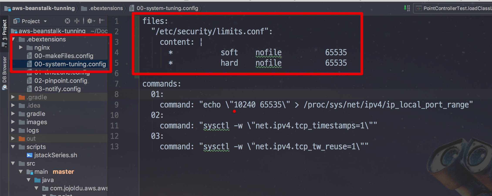
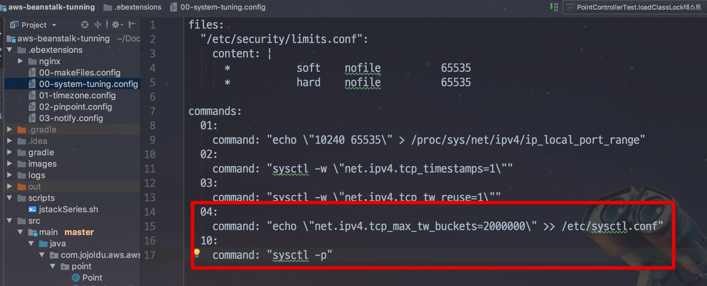

# 4. 기타

자 이번 시간엔 이 시리즈에서 자세히 다루진 않지만, 꼭 해야할 여러 설정 포인트를 정리하겠습니다.  

## 4-1. Open Files

예를 들어 ```@Async``` 혹은 ```CompletableFuture``` 와 같은 비동기 쓰레드를 많이 사용해야하거나, 
응답시간이 오래 걸리는 외부 API 요청이 대량으로 발생하는 경우 등등 대규모 트래픽 서비스에서 자주 발생하는 것이 ```Too many open files``` 에러입니다.  
 
> 좀 더 자세한 내용은 이전에 작성한 [Java, max user processes, open files](http://woowabros.github.io/experience/2018/04/17/linux-maxuserprocess-openfiles.html) 를 참고해보세요!  
**EC2, IDC 에서의 설정 방법이 링크 최하단**에 있습니다.

위 이슈 등으로 인해 기본적으로 Linux 서버에 설정해줘야하는 값이 바로 **Open Files** 입니다.  
AWS Beanstalk 에서도 마찬가지로 이 값을 설정 할 수 있습니다.  
[2번째 시간](http://jojoldu.tistory.com/319)에서 사용했던 ```.ebextension/00-system-tuning.config``` 파일을 활용합니다.



```bash
files:
  "/etc/security/limits.conf":
    content: |
      *           soft    nofile          65535
      *           hard    nofile          65535

```

자 이렇게 설정하셨다면 배포하기전에 잠시 **현재 open files** 값을 확인합니다.


현재 4096이며, 배포를 진행해보시면!


이렇게 65535 값으로 변경된것을 알 수 있습니다!

## 4-2. tcp_max_tw_buckets

다음으로 변경해볼 값은 ```net.ipv4.tcp_max_tw_buckets``` 입니다.  
이 값은 **시스템이 동시에 가질수 있는 timewait 소켓의 최대 개수**입니다.  
이 값을 초과하면 time-wait 소켓을 즉시 파괴하고 경고를 출력합니다.  
  
이 값은 성능 테스트 결과에 맞춰 높이셔도 되는데요.  
**기본값보다 낮추시면 안됩니다**

현재 수치를 확인하는 방법은 아래 명령어로 가능합니다.

```bash
cat /proc/sys/net/ipv4/tcp_max_tw_buckets
```


아래 명령어를 사용하면 적용되니, EC2나 IDC에선 아래 명령어를 사용합니다.

```bash
echo "net.ipv4.tcp_max_tw_buckets=2000000" >> /etc/sysctl.conf
```

숫자에 오타가 발생할수 있기 위해 말씀드리자면 **200만**입니다.  
추가로 위 설정을 **서버에 영구 설정**하기 위해 아래 명령어를 실행합니다.

```bash
sysctl -p
```

Beanstalk의 설정은 위 4-1과 마찬가지로 ```.ebextension/00-system-tuning.config``` 파일을 이용합니다.



```bash
files:
  "/etc/security/limits.conf":
    content: |
      *           soft    nofile          65535
      *           hard    nofile          65535

commands:
  01:
    command: "echo \"10240 65535\" > /proc/sys/net/ipv4/ip_local_port_range"
  02:
    command: "sysctl -w \"net.ipv4.tcp_timestamps=1\""
  03:
    command: "sysctl -w \"net.ipv4.tcp_tw_reuse=1\""
  04:
    command: "echo \"net.ipv4.tcp_max_tw_buckets=2000000\" >> /etc/sysctl.conf"
  10:
    command: "sysctl -p"
```

config 파일 설정후 배포를 해보시면!


이렇게 설정값이 변경된 것을 확인할 수 있습니다!


> 이 외에도 정말 많은 **리눅스 커널 파라미터 가이드가** 있습니다.  
제가 주로 참고하는 2개 사이트인데요.  
다른분들도 이 문서들을 보면서 성능 테스트를 진행해보셨으면 합니다.
[Linux - 레드헷과 수세리눅스에서 사용하는 네트워크 관련 커널변수](https://support.hpe.com/hpsc/doc/public/display?docId=emr_na-c01418125),  [시스템 엔지니어 공동 관리 구역](http://blog.syszone.co.kr/m/634)

## 4-3. Keepalive Time

## 4-4. RDS

이 외에도 많은 RDS 파라미터 튜닝 방법들이 있습니다만,  
제가 DB 전문가가 아니다보니 ㅠ  
여러분들이 직접 서비스 상황에 맞게 성능 테스트를 하면서 조정할 수 밖에 없습니다.  
그래도 조금의 가이드가 있으면 작업하시기 편할것 같아 참고하는 사이트들을 소개합니다.

* [나는 프로그래머다! - DB 튜닝의 모든 것](http://ncrash.github.io/subway-study/2016/12/23/iamprogrammer-db-tuning-chapter1.html)
* [Amazon RDS Performance Tuning Settings](https://gist.github.com/douglasjarquin/2208690)