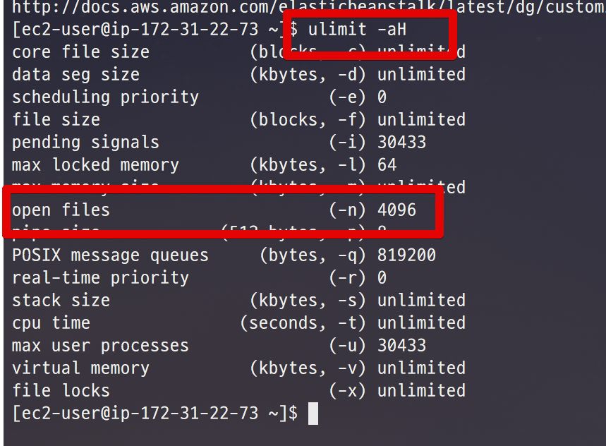

# 4. 기타


## 4-1. Open Files

예를 들어 ```@Async``` 혹은 ```CompletableFuture``` 와 같은 비동기 쓰레드를 많이 사용해야하거나, 
응답시간이 오래 걸리는 외부 API 요청이 대량으로 발생하는 경우 등등 대규모 트래픽 서비스에서 자주 발생하는 것이 ```Too many open files``` 에러입니다.  
 
> 좀 더 자세한 내용은 이전에 작성한 [Java, max user processes, open files](http://woowabros.github.io/experience/2018/04/17/linux-maxuserprocess-openfiles.html) 를 참고해보세요!

위 이슈등으로 인해 기본적으로 Linux 서버에 설정해줘야하는 값이 바로 Open Files 입니다.  
AWS Beanstalk 에서도 마찬가지로 이 값을 설정 할 수 있습니다.  
[2번째 시간](http://jojoldu.tistory.com/319)에서 사용했던 ```.ebextension/00-system-tuning.config``` 파일을 활용합니다.


```
files:
  "/etc/security/limits.conf":
    content: |
      *           soft    nofile          65535
      *           hard    nofile          65535

```

자 이렇게 설정하셨다면 배포하기전에 잠시 현재 open files 값을 확인합니다.



현재 4096이며, 배포를 진행해보시면!


## 4-2. tcp_max_tw_buckets

* [Linux - 레드헷과 수세리눅스에서 사용하는 네트워크관련 커널변수](https://support.hpe.com/hpsc/doc/public/display?docId=emr_na-c01418125)

## 4-3. Keepalive Time

## 4-4. RDS

이 외에도 많은 RDS 파라미터 튜닝 방법들이 있습니다만,  
제가 DB 전문가가 아니다보니 ㅠ  
여러분들이 직접 서비스 상황에 맞게 성능 테스트를 하면서 조정할 수 밖에 없습니다.  
그래도 조금의 가이드가 
* [나는 프로그래머다! - DB 튜닝의 모든 것](http://ncrash.github.io/subway-study/2016/12/23/iamprogrammer-db-tuning-chapter1.html)
* [Amazon RDS Performance Tuning Settings](https://gist.github.com/douglasjarquin/2208690)