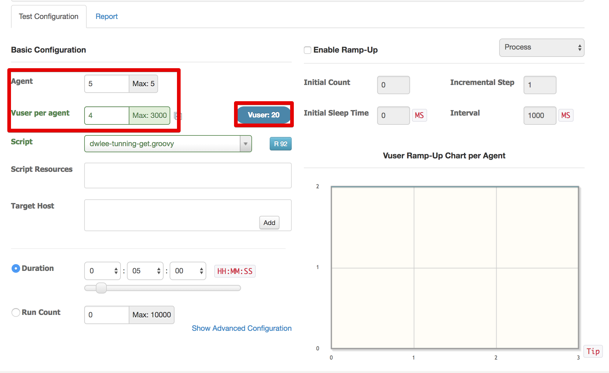
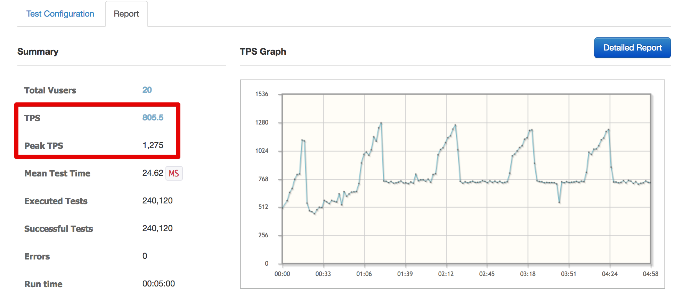
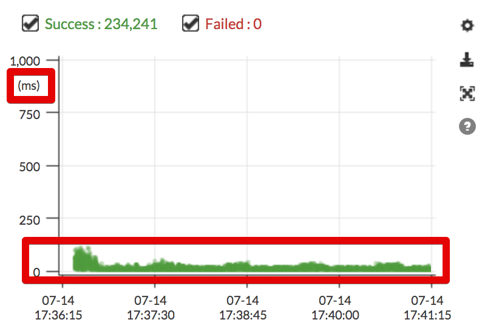
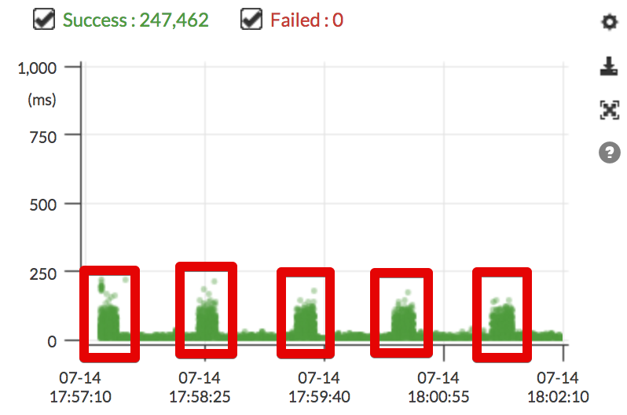
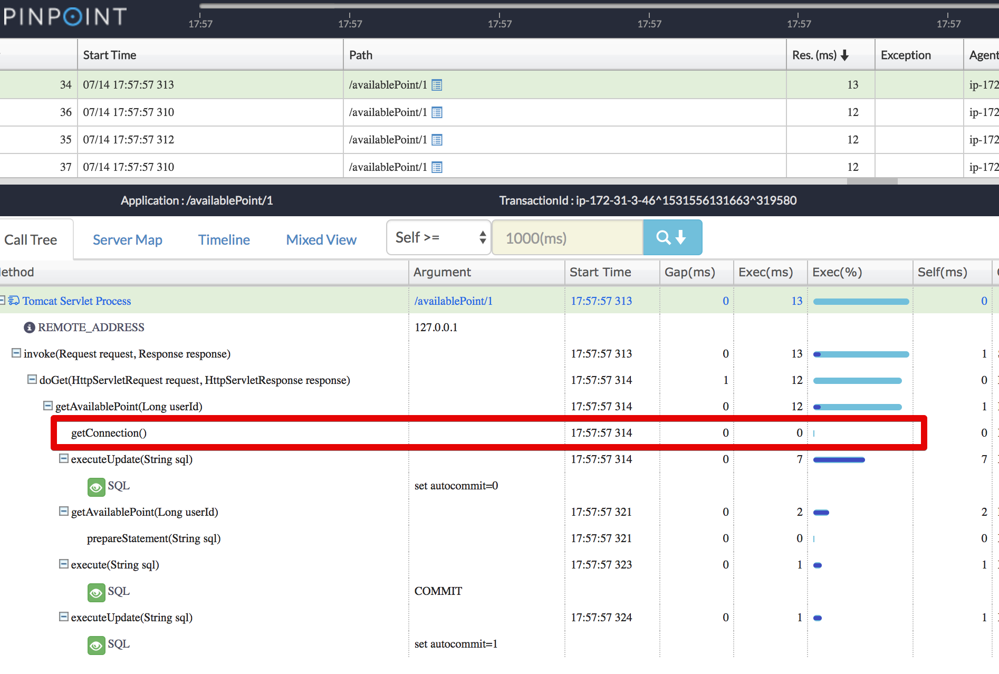
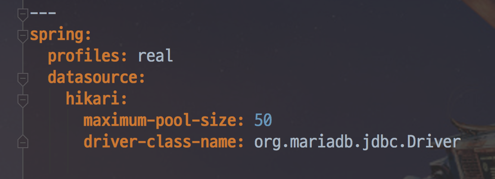

# AWS Beanstalk 성능 튜닝 시리즈

* AWS Elastic Beanstalk
* AWS Aurora RDS
    * AWS와 같은 클라우드 환경에 최적화
    * [AWS Aurora 도입전에 알아야 할 몇가지 사실](https://medium.com/hbsmith/aws-aurora-%EB%8F%84%EC%9E%85%EC%97%90-%EB%8C%80%ED%95%9C-%EB%AA%87%EA%B0%80%EC%A7%80-%EC%82%AC%EC%8B%A4-45eb602bad58) 참고
* Spring Boot 2.0.3

* [Pinpoint](https://github.com/naver/pinpoint)
    * 네이버에서 만든 APM (어플리케이션 모니터링)
* [nGrinder](https://github.com/naver/ngrinder)
    * 네이버에서 만든 부하 테스트 플랫폼
    * [설치가이드](https://github.com/naver/ngrinder/wiki/Installation-Guide)

Pinpoint와 nGrinder의 설치는 이미 되어있는 상태라 가정하고 진행합니다.  

> 성능 개선에 좀 더 초점을 맞춰서 진행하겠습니다.

## 프로젝트 환경

* Elastic Beanstalk 사양
    * t2.medium 1대
* AWS RDS Aurora 사양
    * r4.large 
* DataSource
    * Hikari CP
    * 설정 X (기본값)
* 사용한 쿼리
    * ```select sum(p.amount) from point p where p.user_id=?```

사용한 스프링부트 설정은 아주 깔끔하게 비어있습니다.


> 최소한의 설정으로 **spring.jpa.open-in-view: false** 는 합니다.  
이건 완전히 기본 세팅입니다.  
혹시나 안하신 분이 계시면 꼭 하세요


자 그럼 이제 성능 테스트를 시작해보겠습니다.

> 참고로 여기서 사용하는 테스트가 기준이 될 순 없습니다.  
실제로 DB에 들어간 데이터가 적고, 사용하는 쿼리가 단순하기 때문에 생각보다 훨씬 성능이 잘나옵니다.  
**성능에 문제가 있을때 어떻게 확인하고 어떻게 고치면 되는지** 대략적인 내용을 이해하시는데 초점을 맞춰주세요.  
실제 서비스에서의 TPS는 해당 하드웨어 사양으로는 실험의 1/10도 안나올때도 많습니다.  
쌓여 있는 대량의 데이터, 복잡한 쿼리, 외부 API 연동 등으로 인해 병목 요소가 굉장히 많습니다.


## 1. TPS 800 -> 2000

### 1-1. Vuser 20

5개의 nGrinder Agent 에서 각각 4명의 사용자를 만들어 부하 테스트를 진행합니다.  
(즉 Vuser는 5 * 4 = 20입니다.)



5분간 진행한 테스트 결과를 보면!



* 평균 TPS (초당 처리수): 800
* Peak TPS : 1275

> 참고로 여기서 nGrinder 수치에서 **Errors가 0**인걸 잘 보셔야합니다.  
무작정 TPS만 보시고 발생한 Errors 를 보지 않으시면 무의미한 테스트가 됩니다.  
**Errors가 0인 상황에서 TPS가 얼마나 나오는지가 중요**합니다.

Pinpoint에서 응답 상황을 봐도



100ms (0.1초) 이내로 결과를 반환하는 것을 확인할 수 있습니다.  
  
TPS 800은 무난하게 처리가 됩니다.  
좀 더 높은 수치로 테스트 해보겠습니다.

> 동시접속자와 TPS는 전혀 다른 의미입니다.  
가끔 동접 1만을 TPS 1만처럼 이야기하시는 분들이 계시는데 전혀 다른 수치입니다.  

### 1-2. Vuser 50

자 그럼 이제 Vuser 50으로 설정 후 다시 부하 테스트를 해보겠습니다.  
Vuser 20일때 대략 TPS가 800이 나왔으니 이번에는 2배 이상을 기대해보겠습니다.  
  
5분간 부하를 넣어보면!  


이상하게 **Vuser 20때와 비교해서 TPS가 차이가 나지 않습니다**.  
Pinpoint 그래프를 보면 더더욱 이상한 모양이 나옵니다.



**특정 구간마다 응답 속도가 늦는 것**을 알 수 있습니다.  
자세히 살펴 보면


(응답이 튀는 구간)



(응답이 빠른 구간)  
  
응답이 느릴때는 항상 ```getConnection()```에서 오래 걸린다는 것이 발견되었습니다!  

### Datasource Connection Pool 설정

지금 문제를 보시면 **Database와 Connection을 생성하는 과정에서 병목이 발생**하는 것을 알 수 있습니다.  
Database를 사용할 때마다 Connection을 생성하고 삭제하는 과정이 필요하다보니 병목이 발생하는데요.  
이 문제를 해결할 좋은 방법은 어떤 것이 있을까요?  
  
아마 Spring 이나 다른 웹 프레임워크 관련된 책을 보신 분들은 바로 정답이 생각나실텐데요.  
바로 **Connection Pool**을 사용하는 것입니다.  
미리 일정량의 Connection 을 생성하고, 요청이 오면 해당 Connection을 재사용하는 방식을 얘기합니다.  
  
스프링 부트에서는 아주 쉽게 설정이 가능하기 때문에 바로 설정해보겠습니다.  
현재 사용하는 DBCP인 [HikaciCP](https://github.com/brettwooldridge/HikariCP) 에 맞춰 설정합니다.  
  
**application.yml**



```yaml
---
spring:
  profiles: real
  datasource:
    hikari:
      maximum-pool-size: 200
      driver-class-name: org.mariadb.jdbc.Driver
```

> 주의하실점은 서버가 1대가 아닌 여러대일 경우 **서버들의 maximum-pool-size의 합이 RDS의 max connection 수를 초과**하면 안됩니다.  
 
**minimum-idle**


minimum-idle의 설명을 보면 Connection Pool의 최소 유지수 라고 합니다.  
즉, 사용하지 않을때도 최소한 이정도의 Connection은 유지한다는 뜻입니다.  
**이 값은 사용하지 않습니다**.  

> **HikariCP에서는 maximum-pool-size만 설정되어 있다면 minimum-idle와 maximum-pool-size값을 일치**시킵니다.

**maximum-pool-size**


maximumPoolSize 설명을 보면 아주 좋은 힌트가 있습니다.  
사용하는 Connection의 숫자가 maximum Pool Size에 도달하면 ```getConnection()```을 호출하고, 이때는 최대 connectionTimeout만큼 block 될 수 있다고 합니다.  
딱 저희의 상황과 같죠?  

> 기존에 max-active, max-idle의 값은 모두 maximum-pool-size에 포함되어 있습니다.  
(including both idle and in-use connections)

> Connection Pool에 대해 좀 더 자세하게 알고 싶으신 분들은 [Naver D2 - Commons DBCP 이해하기](https://d2.naver.com/helloworld/5102792) 을 참고해보세요!

## keepalive 개선

## 소켓 재사용 활성화


## RDS -> Redis 전환